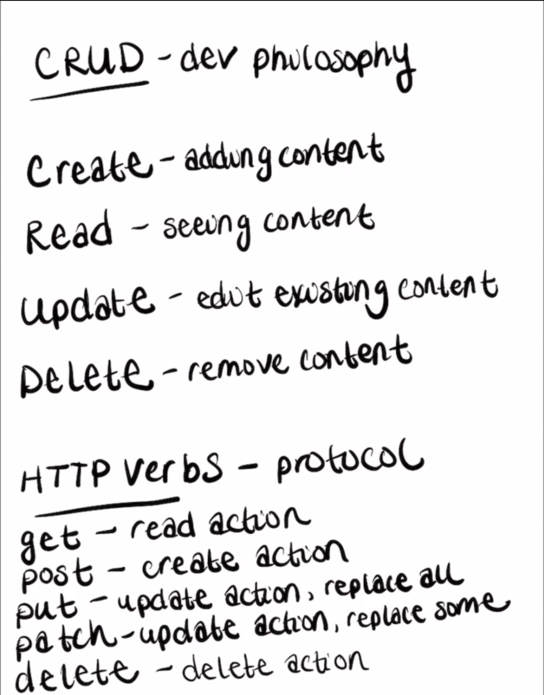

# How the Internet Works

# Hosted - Lives on someone elses server
- Internet is a series of requests and responses
- You are making a new request and response cycle every time you click on a page or navigate or search
    - In this iteraction, you are making requests to a server and the server give you a response

- HTTP - hypertext transfer protocol

- Dreak down request and responses

- Request
    - Location
        - Described by your url (endpoints)
        - Every url is tied to a URL address
        - URL is the human readable part of this
        - IP address is computer readable part
        - Mapping a URL to an IP address
        - The URL is designed by a developer
            - URL describes the type of request
    - Action (CRUD)
        - HTTP verbs (and actions):
            - Create (Post)
            - Read (Get)
            - Update (Put)
            - Delete (Delete)
        - Make the internet work and are important concept to making requests

- Response
    - Status code
        - Many different types of status codes
        - "Is your response good? or not?"
        - Common Codes:
            - 400 Are client side errors
            - 400 Bad Request
            - 401 Unauthorized
            - 404 Does Not Exist (Unhappy path / Catch-all)
                [Github 404](https://github.com/asdjaskld)
            - 200 Everything worked
            - 500 Server side error (bad response)
    - Payload
        - Sends us back an HTML file and or data
            - API (Application Programming Interface) returns Data
            - UI - HTML page that displays content

